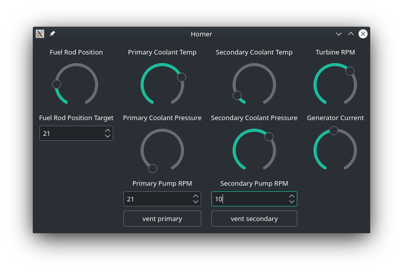

# Homer

Experiments in simulating nuclear power plants.



## Why

For a long time I've wanted to play with a nuclear power plant simulator, and I have memories of a program like this from my childhood (real or imagined, I'm not sure).  I started this project because I thought it would be even more fun to play with a physical simulation, so the plan is to design a simplified operator console to provide a tactile interface to a reactor simulated in software.

## Requirements

Dependencies are pretty basic and defined in [requirements.txt](./requirements.txt).  Given that this is designed to run on an [ESP32](https://en.wikipedia.org/wiki/ESP32) I'm trying to keep external modules to a minimum.

## Usage

Right now there is a single reactor type ([Pressurized Water Reactor](https://en.wikipedia.org/wiki/Pressurized_water_reactor)) and a very simple script to interact with it:

`python3 main.py`

```
----------------------------------
Simulation time: 94
Rod position: 34
Primary temp: 214
Secondary pressure: 20.605000000000004
Turbine RPM: 21
Generator current: 15.75
----------------------------------
command > 

```

There is also a [GUI](./homer_qt.py) (requires Qt) as shown above.

Since the plan is to construct the simulator as a hardware project I probably won't put too much more effort into this script beyond testing basic "playability" of the simulation module.


## Tests

There are tests:

`python -m pytest`
